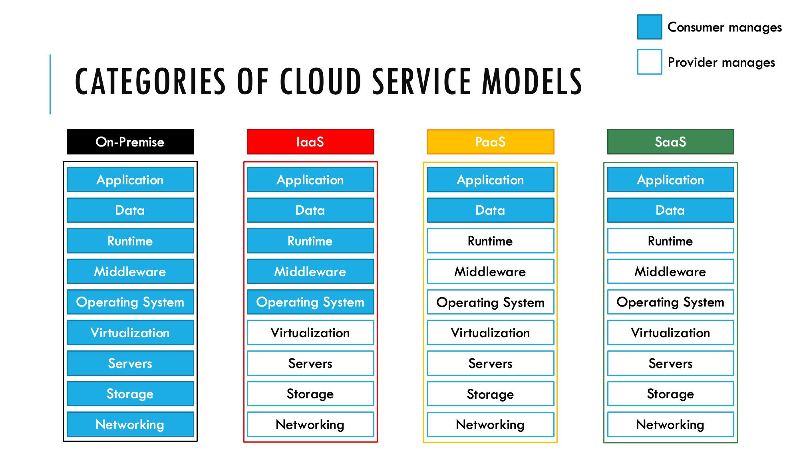

# AZ-900: Microsoft Azure Fundamentals Notes

Below you'll find notes and sources by Skills Measured. The skills outlined are based on the exam skill outline found on [Exam AZ-900: Microsoft Azure Fundamentals > Skills measured](https://docs.microsoft.com/en-us/learn/certifications/exams/az-900)

## Describe Cloud Concepts (20-25%)

### Identify the benefits and considerations of using cloud services

- Benefits of cloud computing
  - More cost-efficient if configured to only use what you need as you needed (Consumption-based model)
    - Allows companies to outsource hardware maintenenace
      - This is sustainable for cloud providers because they can buy hardware in bulk and extend the savings to the consumer (economies of scale)
    - Reduces up-front cost of purchasing physical servers
  - Cloud Computing Characteristics:
    - Reliability: How often you can expect your services to be up and running
      - Responsibility is on the could provider (should be included with Service-Level Agreement)
      - High Availability: A target to have services up and running as close to 100% as possible
        - Protects against common local failures in hardware, network, electricity (etc.)
      - Disaster Recovery: A fallback to use in the main architecture become unavailable for an extended period of time
        - Protects against unforeseen issues with hardware, network, electricity (etc.) caused by natural / human disasters
      - Fault Tolerance: HA but zero-downtime?
    - Scalability: The ability to increase/decrease resources as needed
      - Elasticity: The ability to scale rapidly/automatically
    - Agility: Enables companies to reduce the time from development to production
- Capital Expenditure (CapEx): Funds used for physical assets
  - Able to deduct portion of cost from taxes over the life of the asset
- Operational Expenditure (OpEx): Funds used for op
  - Able to deduct entire cost from taxes in year used
  - Cloud computing will allow companies to shift to using OpEx instead of CapEx

### Describe the differences between categories of cloud services

- Shared responsibility model: The ratio of responsibility between consumer and provider
  
  - On-Premise: Consumer is responsible for infrastructure, OS, data, and applications
  - Infrastructure-as-a-Service (IaaS): Provider is responsible for infrastructure.
    - Examples: Azure, AWS, Google Cloud
    - Scenarios: Test/Development, storage/backups, high performance computing, big data analysis
  - Platform-as-a-Service (PaaS): Provider is responsible for infrastructure + OS
    - Provides a framework to the developer to build applications on
    - Examples: Azure Logic Apps, Heroku, Amazon Elastic Beanstalk, Cloud Foundry
    - Scenarios: Analytics/Business Intelligence, Development frameworks
  - Software-as-a-Service (SaaS): Provider is responsible for infrastructure, OS, data, and applications
    - Usually provided in a web application without the need for installation
    - Examples: Office 365, Gmail, Salesforce, Dropbox
    - Scenarios: Access to sophisticated applications

### Describe the differences between types of cloud computing

- Cloud Computing: Using remote servers/hardware on the internet to store, manage and process data rather than using local servers/hardware
- Public Cloud: Hardware is shared by multiple clients (most popular)
- Private Cloud: Hardware is only used by a single company, usually own by the company itself
  - Can be on-premises, in a company data center
  - Can be online or offline (using an offline version of the cloud provider stack)
- Hybrid Cloud: Public + Private with automation/orchestration between both
- Community Cloud: Private cloud for a group of companies with the same restrictions/regulations
  - Can be used for joint-venture projects or heavily regulated industries (e.g. government, healthcare, finance)
  - Azure offers Sovereign Clouds (e.g. Azure China) that fall under the community cloud model

## Describe Core Azure Services (15-20%)

### Describe the core Azure architectural components

- Regions and Region Pairs
  - Region: Physically location of data center(s)
  - Region Pairs: Data centers located 300+ miles apart for redundancy in case of disaster
  - Exceptions: Globel services don't not need to specify a region (e.g. Azure AD Tenant)
  - Consider user location, compliance, and resource availability when choosing a region
  - Data may be replicated outside of your specified region for certain services
- Availability Zones: Unique, physical locations within a single region (minimum of 3 when available)
  - Can use load balancing for redundancy when availability zones are not possible
- Resource: A manageable item in Azure
- Resource Groups: A container that holds related resources
  - Group resources should share the same lifecycle
  - Group resources only exist in a single group at a time, but can be moved
  - Group resources can communicate across groups and be in different regions
  - Can export metadata as JSON for IaC
- Subscriptions
- Management Groups
- Azure Resource Manager (ARM): Deployment and management service for Azure
  - Azure Portal, Azure PowerShell, Azure CLI, and Azure SDKs are just abstractions of the ARM REST API
  - Authentication is management by Azure AD

### Describe core resources available in Azure

- Compute: Group of services related to running application workloads
  - Virtual Machines: IaaS with full VM control
    - Virtualizes the hardware
    - Must maintain and patch VMs
  - Azure App Services: PaaS to host web apps (akin to AWS Elastic Beanstalk)
    - Similar to traditional web hosting, but Azure manages the web services
    - WebJobs (like Cron Jobs) can be configured to run on the underlying VM
    - Default URL: *.azurewebsites.net
    - You can run multiple app services on the same app service plan
  - Azure Container Instances (ACI): Virtualized environments for running applications
    - Virtualizes the Operating System
    - Packaged environment that can run on any hosting option (local machine, physical server, VMs in cloud, Instances in the cloud)
    - A runnable instance of a container image
    - Azure Container Registry (like the Docker Hub)
    - Intended for smaller applications/environemnts: 1-to-1 instance to image
      - Limited scalability and without high availability
    - Kudu portal allows you to view logs and upload new website files as a zip
  - Azure Kubernetes Service (AKS):
    - Container management system
    - Intended for more complex containers architectures or more granular management
    - Pods: Groups of containers; Nodes: VMs
  - Windows Virtual Desktop: ???
  - Serverless Computing: Build apps without any infrastructure management
    - Azure Functions: Run small blocks of code
      - Initiated by triggers
    - Azure Logic Apps: Configure workflows in the cloud
      - Can call to and from Azure functions
      - Uses UI based "programming" (akin to Salesforce Flows/Process Builder)
    - Azure Event Grid: Build apps to respond to events
      - Connects data sources and event handlers
        - Azure Functions / Logic Apps can be set as handlers
      - Works as a Pub/Sub
- Networking
  - Virtual Networks
  - VPN Gateway
  - Virtual Network peering
  - ExpressRoute
- Data Storage
  - Container (Blob) Storage
  - Disk Storage
  - File Storage
  - Storage tiers
- Database Services
  - Cosmos DB
  - Azure SQL Database
  - Azure Database for MySQL
  - Azure Database for PostgreSQL
  - SQL Managed Instance
- Azure Marketplace

## Describe core solutions and management tools on Azure (10-15%)

### Describe core solutions available in Azure

- Internet of Things (IoT) Hub, IoT Central, and Azure Sphere
- Azure Synapse Analytics, HDInsight, and Azure Databricks
- Azure Machine Learning, Cognitive Services and Azure Bot Service
- serverless computing solutions that include Azure Functions and Logic Apps
- Azure DevOps, GitHub, GitHub Actions, and Azure
  DevTest Labs

### Describe Azure management tools

- functionality and usage of the Azure Portal, Azure PowerShell, Azure CLI, Cloud Shell, and Azure Mobile App
- functionality and usage of Azure Advisor
- functionality and usage of Azure Resource Manager (ARM) templates
- functionality and usage of Azure Monitor
- functionality and usage of Azure Service Health

## Describe general security and network security features (10-15%)

### Describe Azure security features

- describe basic features of Azure Security Center, including policy compliance, security alerts, secure score, and resource hygiene
- functionality and usage of Key Vault
- functionality and usage of Azure Sentinel
- functionality and usage of Azure Dedicated Hosts

### Describe Azure network security

- concept of defense in depth
- functionality and usage of Network Security Groups (NSG)
- functionality and usage of Azure Firewall
- functionality and usage of Azure DDoS protection

## Describe identity, governance, privacy, and compliance features (20-25%)

### Describe core Azure identity services

- explain the difference between authentication and authorization
- define Azure Active Directory
- functionality and usage of Azure Active Directory
- functionality and usage of Conditional Access, Multi-Factor Authentication (MFA), and Single Sign-On (SSO)

### Describe Azure governance features

- functionality and usage of Role-Based Access Control (RBAC)
- functionality and usage of resource
- functionality and usage of tags
- functionality and usage of Azure Policy
- functionality and usage of Azure Blueprints
- Cloud Adoption Framework for Azure

### Describe privacy and compliance resources

- Microsoft core tenets of Security, Privacy, and Compliance
- purpose of the Microsoft Privacy Statement, Product Terms site, and Data Protection Addendum (DPA)
- purpose of the Trust Center
- purpose of the Azure compliance documentation
- purpose of Azure Sovereign Regions (Azure Government cloud services and Azure China cloud services)

## Describe Azure cost management and Service Level Agreements (10-15%)

### Describe methods for planning and managing costs

- identify factors that can affect costs (resource types, services, locations, ingress and egress traffic)
- identify factors that can reduce costs (reserved instances, reserved capacity, hybrid use benefit, spot pricing)
- functionality and usage of the Pricing calculator and the Total Cost of Ownership (TCO) calculator
- functionality and usage of Azure Cost Management

### Describe Azure Service Level Agreements (SLAs) and service lifecycles

- purpose of an Azure Service Level Agreement (SLA)
- identify actions that can impact an SLA (i.e. Availability Zones)
- service lifecycle in Azure (Public Preview and General Availability)
